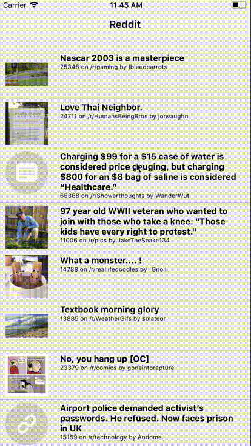

# Demo Reddit client for React Native

Loads the front page of Reddit and displays the posts in a list

## Uses:

* create-react-native-app
* redux
* react-navigation
* redux-persist
* redux-mock-store
* jest-fetch-mock

## Supports:

* loading the first page of reddit
* pull to refresh
* viewing a post
* Android back button and status bar height

## Notes

### Getting started

* `yarn lint` to validate the code is proper
* `yarn test` to start jest in watch mode
* `yarn start` to use the console menu for launching Android or iOS

### Linting
Linting is done via `yarn lint` and uses an
[aggressive .eslintrc](.eslintrc)

### Testing
This project uses [jest-fetch-mock](https://github.com/jefflau/jest-fetch-mock)
to load an [example](__tests__/reddit.json) of Reddit's JSON
and test both the [success path](__tests__/App.test.js#L20)
and the [failure path](__tests__/App.test.js#L41) of
[loading](actions/index.js#L24)
and [parsing](actions/index.js#L1) of the Reddit API.

### Acton creators and reducers
There are 4 total actions.  The 3 related to refreshing are:
`REDDIT_REFRESHING`, `REDDIT_LOADED`, and `REDDIT_ERROR`.  These actions have
[reducers](reducers/index.js#L5) for handling state changes.

There is also a `VIEW_POST`
[action creator](actions/index.js#L45) and corresponding
[reducer](reducers/index.js#L25) for handling navigation events.

### Navigation
For basic "stack" style navigation,
[react-navigation](https://github.com/react-community/react-navigation) is
used. A [Main Screen](navigators/index.js#L14) and the secondary
[View Post Screen](navigators/index.js#L22) reference components
and accept parameters from the navigator.
The [Navigator](navigators/index.js#L35) is wrapped in a class
and some additional global functionality, such as Android back button support,
is added here.

### Components
The [RedditList](components/RedditList.js) uses
`TouchableHighlight` and `FlatList` to create a touchable list of
`RedditListItem`, which is refreshed on first load.

The `RedditList` is comprised of an array of
[RedditListItem](components/RedditListItem.js) which handles
the display of every post in the list.

When a liste item is touched, the a screen with
[RedditViewPost](components/RedditViewPost.js) is pushed and
a `WebView` displays the URL.

### Entry point
The [entry point](App.js#L25) is wrapped with a `View` to
properly handle variable status bar heights on each platform.

This entry point also includes presistence via
[redux-persist](https://github.com/rt2zz/redux-persist)'s auto-rehydrate.
